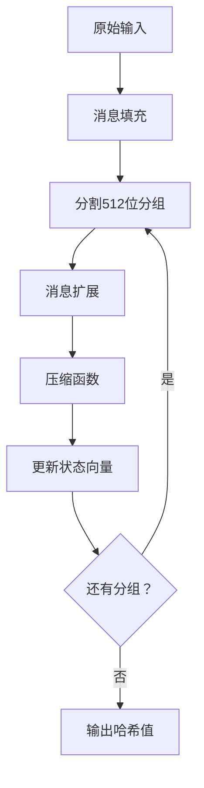

# SM3 哈希算法实现

## 算法数学原理

### 1. 消息填充（Padding）
设原始消息长度为 $l$ 位：
- 添加比特"1"：`0x80`
- 添加 $k$ 个"0"满足：$l + 1 + k ≡ 448 \pmod{512}$
- 添加64位消息长度 $l$（大端序）

### 2. 消息扩展
将512位分组扩展为132个字（32位）：
1. 前16个字直接分割
2. 后续52个字计算：
   $W_j = P_1(W_{j-16} \oplus W_{j-9} \oplus (W_{j-3} \ll 15) \oplus (W_{j-13} \ll 7) \oplus W_{j-6}$
3. 派生64个字：
   $W_j' = W_j \oplus W_{j+4}$

### 3. 压缩函数 64 轮迭代计算

$$
\begin{aligned}
& \text{SS1} = ((A \ll 12) + E + (T_j \ll (j \mod 32))) \ll 7 \\
& \text{SS2} = \text{SS1} \oplus (A \ll 12) \\
& \text{TT1} = \text{FF}_j(A, B, C) + D + \text{SS2} + W_j \\
& \text{TT2} = \text{GG}_j(E, F, G) + H + \text{SS1} + W_j \\
\end{aligned}
$$

寄存器更新：

- D ← C
- C ← B << 9
- B ← A
- A ← TT1
- H ← G
- G ← F << 19
- F ← E
- E ← P0(TT2)

### 4. 关键组件

#### 布尔函数

$$
FF_j(X, Y, Z) = 
\begin{cases} 
X \oplus Y \oplus Z & \text{if } 0 \leq j \leq 15 \\ 
(X \land Y) \lor (X \land Z) \lor (Y \land Z) & \text{if } 16 \leq j \leq 63 
\end{cases}
$$

$$
GG_j(X, Y, Z) = 
\begin{cases} 
X \oplus Y \oplus Z & \text{if } 0 \leq j \leq 15 \\ 
(X \land Y) \lor (\neg X \land Z) & \text{if } 16 \leq j \leq 63 
\end{cases}
$$


#### 置换函数
- **P₀(X)：**  $$P_0(X) = X \oplus (X \ll 9) \oplus (X \ll 17)$$

- **P₁(X)：**  $$P_1(X) = X \oplus (X \ll 15) \oplus (X \ll 23)$$

#### 常量

$$T_j = \begin{cases} 
0x79CC4519 & \text{if } 0 \leq j \leq 15 \\ 
0x7A879D8A & \text{if } 16 \leq j \leq 63 
\end{cases}$$
  
## 代码实现架构

### 核心处理流程




## 测试验证
实现包含三个标准测试用例：

```cpp
测试用例 1:
  输入: <empty>
  标准哈希: 1ab21d8355cfa17f8e61194831e81a8f22bec8c728fefb747ed035eb5082aa2b

测试用例 2:
  输入: "abc"
  标准哈希: 66c7f0f462eeedd9d1f2d46bdc10e4e24167c4875cf2f7a2297da02b8f4ba8e0

测试用例 3:
  输入: "abcdabcdabcdabcd...abcd" (64字符)
  标准哈希: debe9ff92275b8a138604889c18e5a4d6fdb70e5387e5765293dcba39c0c5732
```

测试结果如下：
