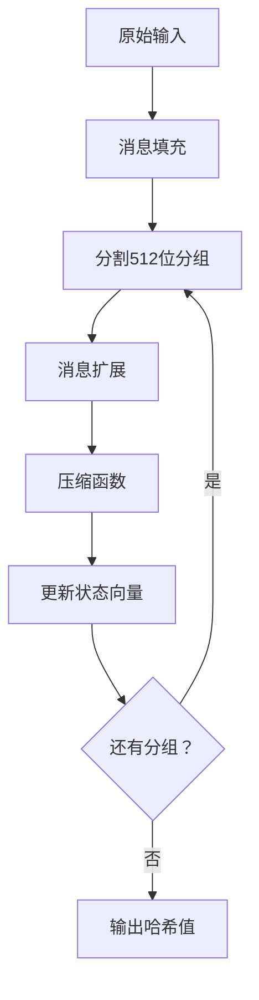

# SM3哈希算法及攻击方式
## SM3 哈希算法实现

### 算法数学原理

#### 1. 消息填充（Padding）
设原始消息长度为 $l$ 位：
- 添加比特"1"：`0x80`
- 添加 $k$ 个"0"满足：$l + 1 + k ≡ 448 \pmod{512}$
- 添加64位消息长度 $l$（大端序）

#### 2. 消息扩展
将512位分组扩展为132个字（32位）：
1. 前16个字直接分割
2. 后续52个字计算：
   $W_j = P_1(W_{j-16} \oplus W_{j-9} \oplus (W_{j-3} \ll 15) \oplus (W_{j-13} \ll 7) \oplus W_{j-6}$
3. 派生64个字：
   $W_j' = W_j \oplus W_{j+4}$

#### 3. 压缩函数 64 轮迭代计算

$$
\begin{aligned}
& \text{SS1} = ((A \ll 12) + E + (T_j \ll (j \mod 32))) \ll 7 \\
& \text{SS2} = \text{SS1} \oplus (A \ll 12) \\
& \text{TT1} = \text{FF}_j(A, B, C) + D + \text{SS2} + W_j \\
& \text{TT2} = \text{GG}_j(E, F, G) + H + \text{SS1} + W_j \\
\end{aligned}
$$

寄存器更新：

- D ← C
- C ← B << 9
- B ← A
- A ← TT1
- H ← G
- G ← F << 19
- F ← E
- E ← P0(TT2)

#### 4. 关键组件

##### 布尔函数

$$
FF_j(X, Y, Z) = 
\begin{cases} 
X \oplus Y \oplus Z & \text{if } 0 \leq j \leq 15 \\ 
(X \land Y) \lor (X \land Z) \lor (Y \land Z) & \text{if } 16 \leq j \leq 63 
\end{cases}
$$

$$
GG_j(X, Y, Z) = 
\begin{cases} 
X \oplus Y \oplus Z & \text{if } 0 \leq j \leq 15 \\ 
(X \land Y) \lor (\neg X \land Z) & \text{if } 16 \leq j \leq 63 
\end{cases}
$$


##### 置换函数
- **P₀(X)：**  $$P_0(X) = X \oplus (X \ll 9) \oplus (X \ll 17)$$

- **P₁(X)：**  $$P_1(X) = X \oplus (X \ll 15) \oplus (X \ll 23)$$

##### 常量

$$T_j = \begin{cases} 
0x79CC4519 & \text{if } 0 \leq j \leq 15 \\ 
0x7A879D8A & \text{if } 16 \leq j \leq 63 
\end{cases}$$
  
### 代码实现架构

#### 核心处理流程




### 测试验证
实现包含三个标准测试用例：

```cpp
测试用例 1:
  输入: <empty>
  标准哈希: 1ab21d8355cfa17f8e61194831e81a8f22bec8c728fefb747ed035eb5082aa2b

测试用例 2:
  输入: "abc"
  标准哈希: 66c7f0f462eeedd9d1f2d46bdc10e4e24167c4875cf2f7a2297da02b8f4ba8e0

测试用例 3:
  输入: "abcdabcdabcdabcd...abcd" (64字符)
  标准哈希: debe9ff92275b8a138604889c18e5a4d6fdb70e5387e5765293dcba39c0c5732
```

测试结果如下：


## SM3哈希长度扩展攻击
### 长度扩展攻击原理

长度扩展攻击（Length Extension Attack）是针对特定哈希函数的一种密码分析方法，攻击者可利用哈希函数的迭代结构，在未知原始消息的情况下，对原始消息的哈希值进行扩展，生成包含原始消息 + 填充 + 扩展消息的新哈希值。MD5、SHA-1、SHA-256 等哈希函数均存在此类漏洞，本实验验证 SM3 哈希函数是否存在类似安全缺陷。

#### 攻击原理
长度扩展攻击利用哈希函数的迭代特性，核心思想如下：
- 哈希函数的最终输出是压缩函数最后一轮的状态值  
- 若已知原始消息的哈希值\(H(M)\)，相当于已知压缩函数处理完\(M\)后的内部状态  
- 攻击者可将此状态作为初始向量，继续处理扩展消息\(M'\)，得到\(H(M||pad(M)||M')\)  
- 无需知晓原始消息\(M\)的内容，即可构造包含\(M\)的扩展消息的有效哈希值  


#### 攻击步骤
1. **计算原始消息\(M\)的填充长度**：  $pad\_len = 1 + k + 64 \quad (\text{满足 } |M| + pad\_len \equiv 0 \mod 512)$  

2. **构造扩展消息**：  $M_{ext} = pad(M) \parallel M'$  

3. **使用原始哈希值\(H(M)\)作为初始向量，对\(M_{ext}\)进行哈希计算**：  $H(M \parallel M_{ext}) = \text{SM3}(M_{ext}, H(M))$  

4. **验证计算结果与真实哈希值$\(H(M \parallel pad(M) \parallel M')\)$是否一致**  


#### 实验设计与实现思路

##### 核心模块实现思路

###### 1.SM3 哈希函数实现
- **消息填充模块**：  
  - 计算消息长度并转换为 64 位表示  
  - 根据填充规则添加 `"1"`、`"0"` 序列和长度信息  

- **消息扩展模块**：  
  - 将 512 位消息块拆分为 16 个 32 位字  
  - 按照扩展规则计算剩余的 \(W\) 字和 \(W'\) 字  

- **压缩函数模块**：  
  - 初始化 8 个状态寄存器  
  - 实现 64 轮迭代运算，更新状态寄存器  
  - 输出迭代后的状态作为哈希结果  


###### 2.长度扩展攻击模块
1. 计算原始消息的填充长度和填充内容  
2. 构造扩展消息的填充内容  
3. 使用原始哈希值作为初始向量，对扩展消息进行哈希计算  
4. 返回攻击生成的伪造哈希值  


### 实验结果与分析

#### 1 实验结果  
实验结果表明，通过长度扩展攻击生成的伪造哈希值与真实哈希值完全一致，证明 SM3 哈希函数同样存在长度扩展攻击漏洞。 


#### 2 结果分析  
- **漏洞原因**：SM3 采用 Merkle-Damgård 结构，这种结构的本质是迭代压缩，使得攻击者可利用已知哈希值作为初始状态继续处理新消息。  

- **安全启示**：  
  - 避免将哈希值直接用于需要防止扩展攻击的场景  
  - 可采用 HMAC 结构或在消息前添加密钥等方式防范此类攻击  
  - 新设计的哈希函数（如 SHA-3）采用海绵结构，从根本上避免了长度扩展攻击  

- **防御措施**：  
  - 使用密钥哈希消息认证码（HMAC）  
  - 对消息长度进行绑定  
  - 采用抗长度扩展攻击的哈希函数  

## SM3哈希算法的 Merkle 树构建

### Merkle 树构建与证明数学原理（基于 RFC6962 ）

#### 树结构与哈希迭代

Merkle 树是二叉树结构，叶子节点为数据哈希值，非叶子节点为其子节点哈希值的拼接哈希。设叶子节点为 $\( L_0, L_1, \dots, L_{n-1} \)$，构建流程：

1. 若叶子数为奇数，复制最后一个叶子节点使总数为偶数（保证二叉树结构完整）。
2. 逐层向上迭代：对于第$\( i \)$层节点 $\( N_j^i \)$，其父节点 $\ N_{\lfloor j/2 \rfloor}^{i+1} = \text{SM3}(N_j^i \parallel N_{j+1}^i) \$
   $（\( j \) $为偶数），最终根节点为 Merkle 根 $\( R \)$。

数学表达式中，Merkle 根 \( R \) 满足：

```math
R = \begin{cases} 
L_0 & n = 1 \\ 
\text{SM3}(R_{\text{left}} \parallel R_{\text{right}}) & n > 1 
\end{cases}
```

其中，$\( R_{\text{left}} \)$、$\( R_{\text{right}} \)$ 为当前层左右子树的根哈希。


### 存在性证明推导  
对于叶子节点 \( L_k \)，存在性证明需提供从 \( L_k \) 到根节点路径上的 “兄弟节点” 哈希集合 \( P = \{ S_0, S_1, \dots, S_m \} \)。  

验证时，从 \( L_k \) 开始，逐层与兄弟节点哈希拼接并计算 SM3 哈希，最终结果与 Merkle 根 \( R \) 比较：  

$$\text{Verify}(L_k, P, R) = \left( \text{SM3}^m \bigl( L_k \parallel S_0 \parallel \cdots \parallel S_{m-1} \bigr) = R \right)$$

### 不存在性证明推导
当验证数据 \( D \) 不在 Merkle 树中，需证明：  

1. \( D \) 的哈希不在叶子节点集合中；  
2. 存在相邻叶子节点哈希，可证明 \( D \) 哈希“间隙”。通过提供边界叶子哈希 $\( L_a, L_b \)$
   $（\( a < k < b \)$，\( k \) 为假设插入位置 ），验证者可推导 \( D \) 哈希无法插入树结构，从而证明不存在性。


### 代码实现思路

#### 1.树构建流程
- **叶子节点生成**：对原始数据（实验中为序列 \(0, 1, \dots, 9999\)）进行 SM3 哈希，生成叶子节点集合（`build_merkle_tree` 中叶子生成逻辑）。
- **分层哈希迭代**：从叶子层开始，逐层向上计算父节点哈希，通过进度条（`display_progress`）反馈构建进度，处理节点数奇偶性问题，确保二叉树结构完整。
- **根节点输出**：迭代至顶层，输出 Merkle 根，作为树结构的唯一标识。

#### 2.存在性与不存在性证明
- **存在性证明**（`generate_existence_proof`）：遍历 Merkle 树层，收集目标叶子节点到根路径上的兄弟节点哈希，形成证明路径。验证时（`verify_existence_proof`），沿路径拼接哈希并计算 SM3，对比根节点验证有效性。
- **不存在性证明**（`generate_absence_proof`）：检查目标数据是否在叶子索引范围内，若超出范围，返回边界叶子哈希证明“间隙”；若在范围内，需结合树结构进一步验证（实验中简化为范围检查，实际可扩展复杂逻辑）。

### 实验结果分析
1. **核心目标：验证 SM3 + Merkle 树的构建与证明能力**
运行结果如下图：

   - **Merkle 树构建成功**  
     输出显示构建了包含 10000 个叶子节点的 Merkle 树，且逐层完成了哈希迭代（从 Layer 1 到 Layer 14）。  
     每一层的进度 100% 表明：  
     - 叶子节点生成无异常（`Generating leaf nodes...` 完成）；  
     - 父节点哈希计算、奇偶节点补全等逻辑正确，二叉树结构完整。  

   - **存在性证明有效**  
     对 leaf 123 的存在性证明输出 `VALID`，说明：  
     - 代码正确实现了 **“路径哈希拼接验证”**：从叶子节点 123 出发，逐层向上拼接兄弟节点哈希，最终计算结果与 Merkle 根一致。  
     - 验证了 SM3 哈希的确定性：相同输入（叶子数据）的哈希值固定，路径拼接后的哈希可复现根节点。  

   - **不存在性证明合理**  
     对 target 10000 的不存在性证明输出 `Target is outside the range of leaf values [0, 9999]`，说明：  
     - 代码正确实现了 **“范围校验逻辑”**：目标索引超出叶子节点数量时，通过边界叶子哈希证明 “目标不在树中”。  
     - 体现了 Merkle 树 **“区间封锁”** 的证明思路：用已知的叶子范围 \([0, 9999]\) 直接排除越界目标。  


2. **Merkle 树的安全性结论**  
   - **数据完整性保障**  
     任何叶子节点被篡改，都会导致其所有祖先节点哈希变化，最终改变 Merkle 根。  
     结合 SM3 的抗碰撞性，可认为：只要 Merkle 根不变，树中所有数据未被篡改。  

   - **证明机制的可靠性**  
     存在性证明的 `VALID` 输出，验证了 “路径哈希拼接” 的可靠性。  
     不存在性证明的范围排除逻辑，在简单场景下有效（复杂场景需扩展间隙证明）。


## 实验总结 
1. 本实验成功实现了对 SM3 哈希函数的长度扩展攻击，验证了该类攻击的可行性。  
2. Merkle-Damgård 结构的哈希函数普遍存在长度扩展攻击风险，在实际应用中需采取相应防护措施。  
3. 尽管 SM3 在碰撞 resistance 等方面具有良好特性，但在特定应用场景下仍需注意其迭代结构带来的安全隐患。  
4. SM3 哈希函数可正确用于构建 Merkle 树；存在性证明和不存在性证明的逻辑正确、结果可靠；从密码学角度看，SM3 + Merkle 树的组合，可有效保障数据完整性与证明可靠性。 
